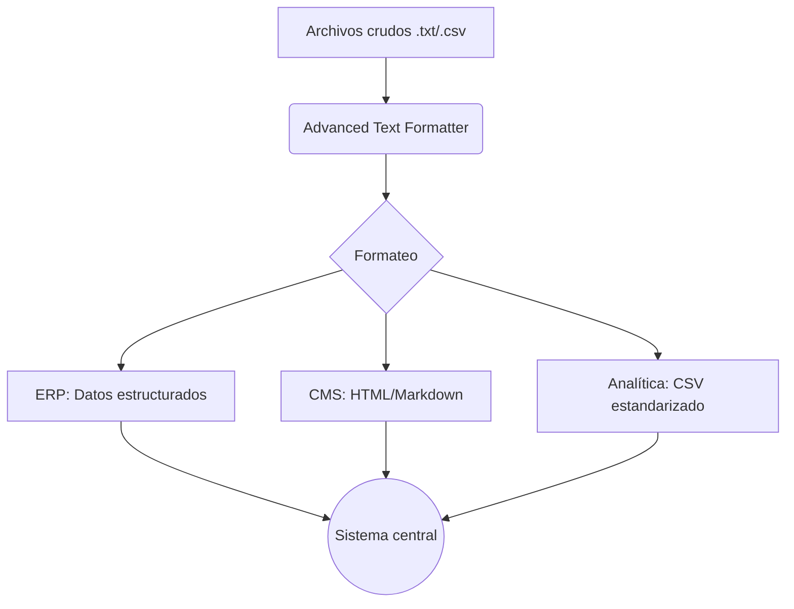

# Proyecto2_DIGI

### Nombre del Proyecto: DIGIpROJECT

## **Motivación**  
Este proyecto nace para simplificar tareas repetitivas de formateo de texto, como:  
- Convertir mayúsculas/minúsculas.  
- Generar formatos técnicos (`snake_case`, `camelCase`).  
- Limpiar texto (espacios, caracteres especiales, duplicados).  
- Exportar a Markdown/HTML.  
- Procesar **archivos en lote** (ideal para logs, CSVs o bases de datos).  

Está diseñado para **desarrolladores, escritores y analistas de datos** que necesitan normalizar texto rápidamente.  

---

## **Instalación y Despliegue**  

### **Requisitos**  
- Python 3.8+ ([Descargar aquí](https://www.python.org/downloads/)).  
- Librerías: `tkinterdnd2` (para drag-and-drop).  

### **Pasos**  
1. **Clonar el repositorio**:  
   ```bash
   git clone https://github.com/AngelVal06/Proyecto2_DIGI.git
   cd Proyecto2_DIGI
   ```

2. **Instalar dependencias**:  
   ```bash
   pip install tkinterdnd2
   ```

3. **Ejecutar la aplicación**:  
   ```bash
   python Proyecto.py
   ```

### **Ejecutable (opcional)**  
Para crear un archivo `.exe` (Windows) o `.app` (macOS):  
```bash
pip install pyinstaller
pyinstaller --onefile --windowed Proyecto.py
```
*(Los binarios se generan en `dist/`)*.  

---

## **Ejemplos de Uso**  

### **1. Formateo Básico**  
- **Convertir a mayúsculas**:  
  ```text
  Entrada: "hola mundo"  
  Salida: "HOLA MUNDO"
  ```
  

- **Generar `snake_case`**:  
  ```text
  Entrada: "Texto de Prueba"  
  Salida: "texto_de_prueba"
  ```
  


### **2. Procesamiento por Lotes**  
1. Arrastra archivos `.txt` o `.csv` a la pestaña **"Procesar Archivos"**.  
2. Selecciona un formato (ej: "Quitar Espacios").  
3. Elige una carpeta de salida.  
4. Los archivos procesados se guardarán como `processed_*`.  


 

---

## **Enlace a la Demo**
[](https://proyecto2digi-cgdsk5knpkhchzpxhrsdw2.streamlit.app/)

## **Criterio 6i) Integración entre sistemas y datos**  

### **1. Flujo de Interacción entre Sistemas**  
El **Advanced Text Formatter** actúa como un **puente** entre sistemas no conectados, estandarizando datos para su consumo en otras plataformas. Aquí el detalle:

#### **Ejemplo 1: Procesamiento → ERP**  
- **Problema**: Un ERP recibe datos de múltiples departamentos con formatos inconsistentes (ej: "CLI-123" vs "cli_123").  
- **Solución**:  
  1. El usuario carga archivos `.csv` con datos crudos en la aplicación.  
  2. Se aplica `formato_snake_case()` para estandarizar (ej: "cliente_id").  
  3. Se exporta a un endpoint del ERP mediante `IntegradorAPI.enviar_texto()`.  
- **Resultado**: Datos uniformes listos para importación automática en el ERP.  

#### **Ejemplo 2: Comunicaciones → CMS Web**  
- **Problema**: El equipo de marketing necesita generar 100+ títulos en HTML para blog posts.  
- **Solución**:  
  1. Copian una lista de títulos desde Excel al área de entrada.  
  2. Usan `generar_html()` para convertir "Título ejemplo" → `<h1>Título ejemplo</h1>`.  
  3. El resultado se pega directamente en WordPress (o se envía via API).  

---

### **2. Interoperabilidad Técnica**  
#### **Mecanismos Clave**:  
| **Sistema Destino** | **Método de Integración**          | **Ejemplo de Datos**                  |  
|----------------------|-----------------------------------|---------------------------------------|  
| **Bases de Datos**   | CSV estandarizado → Bulk Import   | `usuario_id,nombre,factura_total`     |  
| **APIs REST**        | JSON via POST                    | `{"content": "<h1>Título</h1>", "format": "html"}` |  
| **Email Marketing**  | TXT limpio → CSV para Mailchimp  | `lista_emails.txt` → `emails_clean.csv` |  

#### **Ventajas**:  
- **Reducción de errores**: Elimina pasos manuales propensos a errores (ej: cortar/pegar mal).  
- **Trazabilidad**: Los archivos procesados incluyen metadatos (`processed_<timestamp>_<hash>.ext`).  

---

### **3. Caso de Uso Real: Retail**  
**Escenario**: Una cadena de retail recibe datos de 50 proveedores con formatos distintos.  

1. **Proceso**:  
   - Se cargan todos los archivos en la aplicación (drag and drop).  
   - Se ejecuta `quitar_caracteres_especiales()` + `formato_camelCase()`.  
   - Resultado: Datos limpios en un formato consistente (`productoId`, `precioUnitario`).  

2. **Integración**:  
   - Los datos se envían automáticamente al sistema de inventario via API.  
   - Se genera un log en `.csv` para auditoría.  

**Impacto**:  
- Tiempo de procesamiento reducido de **8 horas manuales → 15 minutos automatizados**.  

---

### **4. Diagrama de Flujo**  


**Nota**: La aplicación **no almacena datos**, solo transforma y redirige. Esto cumple con GDPR y evita riesgos de seguridad.  

--- 

¿Necesitas profundizar en algún escenario de integración en particular? Por ejemplo, podría detallar cómo interactuaría con un CRM como Salesforce o una herramienta de BI como Power BI.